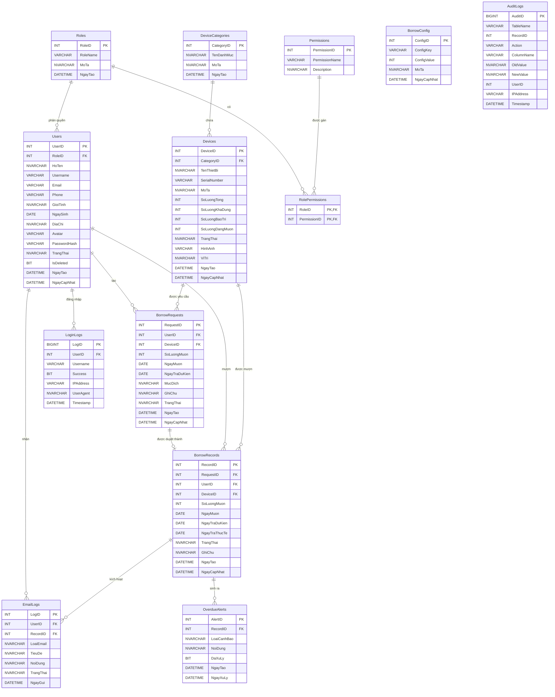

# Lược Đồ ERD - Cơ Sở Dữ Liệu Quản Lý Mượn Thiết Bị

Lược đồ dưới đây phản ánh các bảng đang có trong script SQL hiện tại, gồm phần nghiệp vụ lõi, audit và security.

### Ghi Chú
- `UserNotifications` được backend tạo runtime nếu chưa tồn tại, nên không nằm trong script khởi tạo ban đầu.
- `BorrowRequests` là yêu cầu chờ duyệt; khi được duyệt sẽ tạo `BorrowRecords`.
- `BorrowRecords` là nguồn cho thống kê, cảnh báo quá hạn và lịch sử mượn trả của sinh viên.
