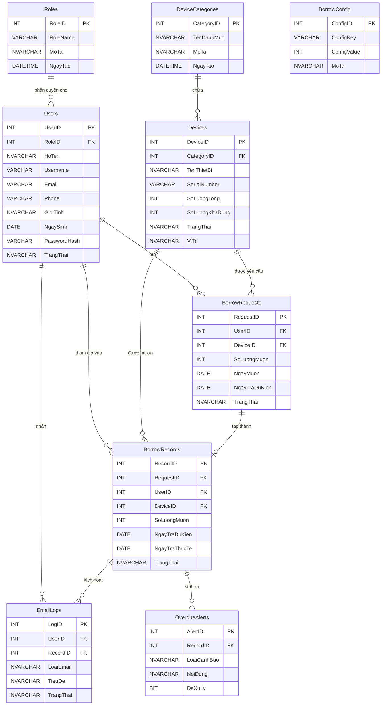

# Lược đồ ERD - Cơ sở dữ liệu Quản lý mượn thiết bị

Dưới đây là lược đồ Entity-Relationship (ERD) được tạo từ cấu trúc bảng trong thư mục Database, sử dụng cú pháp Mermaid. Lược đồ này thể hiện đầy đủ 9 bảng, các trường dữ liệu quan trọng và mối quan hệ (Foreign Keys) giữa chúng.

### Các mối quan hệ chính:
1. **Roles - Users (1:N):** Một nhóm quyền (Role) có thể được cấp cho nhiều người dùng.
2. **DeviceCategories - Devices (1:N):** Một danh mục chứa nhiều thiết bị.
3. **Users - BorrowRequests (1:N):** Một người dùng (Sinh viên) có thể tạo nhiều yêu cầu mượn.
4. **Devices - BorrowRequests (1:N):** Một thiết bị có thể nằm trong nhiều yêu cầu mượn khác nhau theo thời gian.
5. **BorrowRequests - BorrowRecords (1:1/N):** Khi một Yêu cầu mượn (`BorrowRequests`) được duyệt, nó sẽ trở thành một Bản ghi mượn (`BorrowRecords`) chính thức.
6. **BorrowRecords - EmailLogs (1:N):** Quá trình mượn trả có thể kích hoạt nhiều email nhắc nhở (Đến hạn, Quá hạn, Đã trả).
7. **BorrowRecords - OverdueAlerts (1:N):** Nếu quá hạn trả, hệ thống sẽ sinh ra các cảnh báo.
